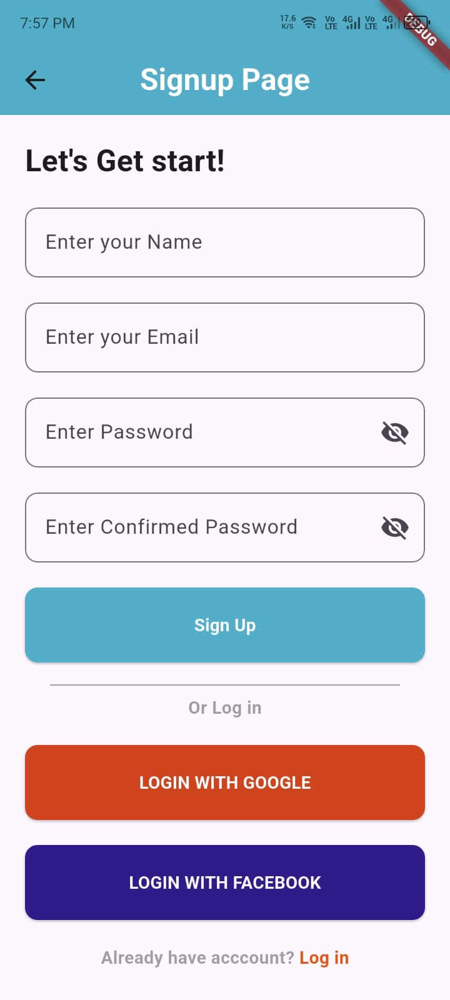
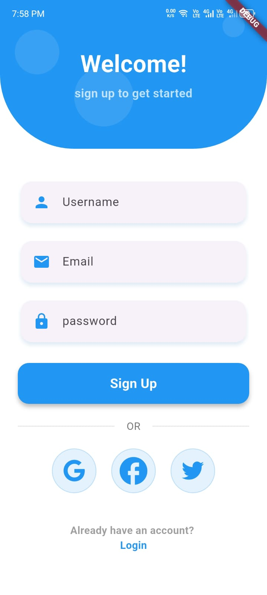
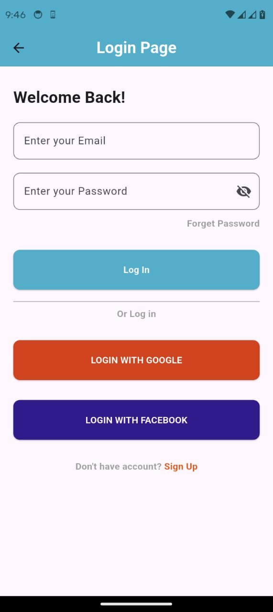
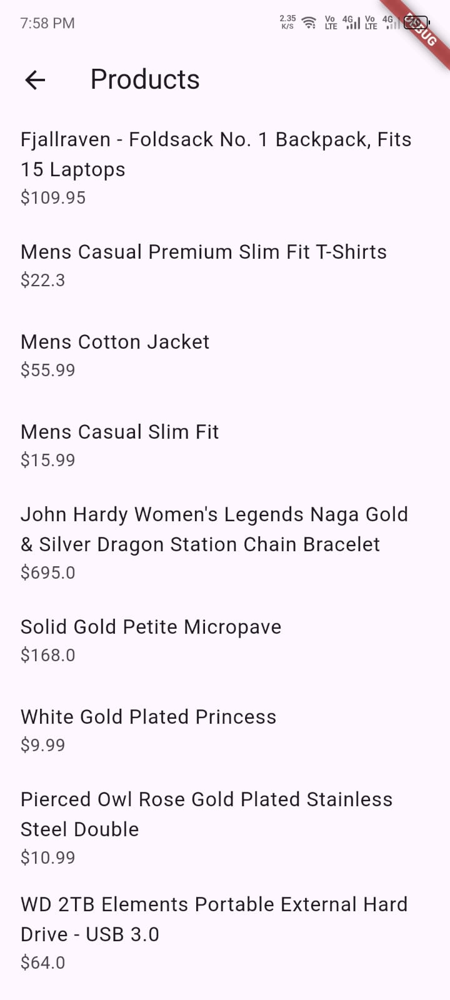
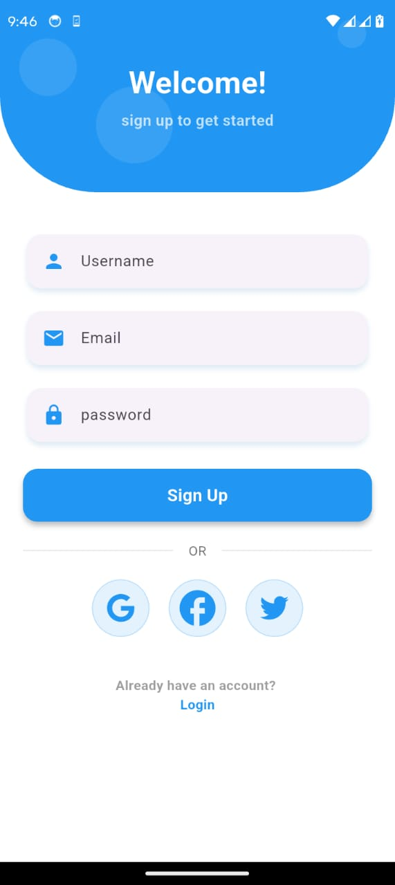
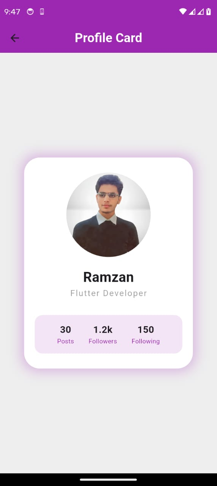
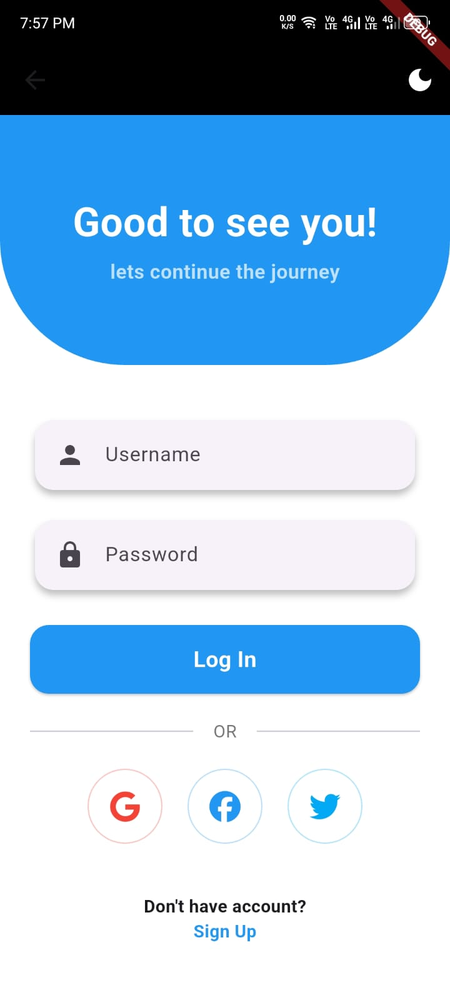
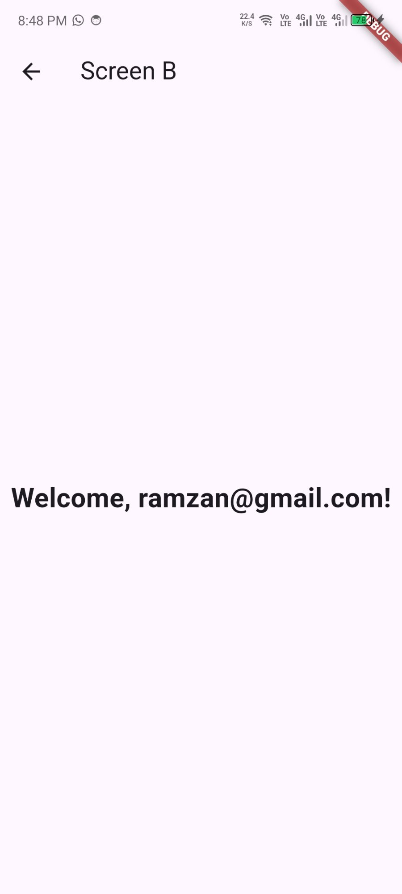
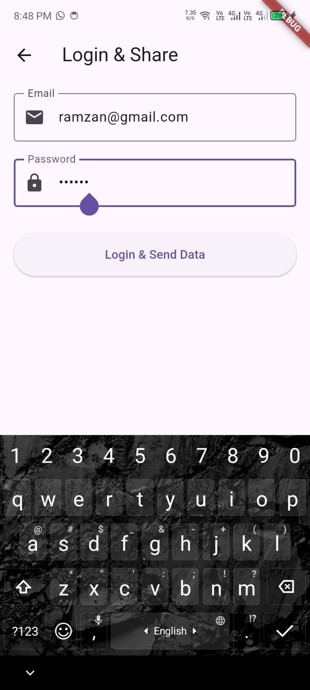

# 📱 Flutter Fellowship — Demo App

A Flutter learning project showcasing multiple UI screens, navigation patterns, API integration, and data handling.

---

## 🚀 Features

- Multiple login & signup screen designs (Simple + Modern)
- Profile card UI
- Data validation & form handling
- Product listing screen (REST API)
- Weather app with live API integration
- Screen navigation hub

---

## 📸 Screenshots
//screens
<table>
  <tr>
    <td align="center"><b>Main Screen</b></td>
    <td align="center"><b>Simple Signup</b></td>
    <td align="center"><b>Simple Login</b></td>
  </tr>
  <tr>
    <td></td>
    <td></td>
    <td></td>
  </tr>
  <tr>
    <td align="center"><b>Modern Login</b></td>
    <td align="center"><b>Modern Signup</b></td>
    <td align="center"><b>Profile Card</b></td>
  </tr>
  <tr>
    <td></td>
    <td></td>
    <td></td>
  </tr>
  <tr>
    <td align="center"><b>Products Screen</b></td>
    <td align="center"><b>Data Validation</b></td>
    <td align="center"><b>Weather App</b></td>
  </tr>
  <tr>
    <td></td>
    <td></td>
    <td></td>
  </tr>
</table>

---

## 🛠️ Tech Stack

- **Flutter** (Dart)
- **REST API** — OpenWeatherMap, FakeStoreAPI
- **HTTP** package for network calls
- **flutter_dotenv** for API key security

---

## ⚙️ Setup

### 1. Clone the repo
```bash
git clone https://github.com/YOUR_USERNAME/demo_app.git
cd demo_app
```

### 2. Install dependencies
```bash
flutter pub get
```

### 3. Create `.env` file in project root
```
WEATHER_API_KEY=your_openweathermap_api_key_here
```

> Get your free API key at [openweathermap.org](https://openweathermap.org/api)

### 4. Run the app
```bash
flutter run
```

---

## 📁 Project Structure

```
lib/
├── main.dart
├── screens/
│   ├── mainscreen.dart       # Navigation hub
│   ├── login.dart            # Simple login
│   ├── login1.dart           # Modern login
│   ├── signup.dart           # Simple signup
│   ├── signup1.dart          # Modern signup
│   ├── profile_card.dart     # Profile UI
│   ├── weather_screen.dart   # Weather app
│   ├── product_screen.dart   # Products list
│   └── home_page.dart
├── modals/
│   ├── Weather.dart
│   └── product.dart
└── services/
    └── weather_service.dart
```

---

## 🔒 API Key Security

This project uses `flutter_dotenv` to keep the API key out of version control.

- `.env` is listed in `.gitignore` — it will **not** be pushed to GitHub
- A `.env.example` file is provided as a template

---

## 📦 Dependencies

```yaml
dependencies:
  flutter_dotenv: ^5.1.0
  http: ^1.2.0
  font_awesome_flutter: ^10.0.0
```

---

## 👨‍💻 Author

**Ramzan** — Flutter Developer

---

## 📄 License

This project is open source and available under the [MIT License](LICENSE).
