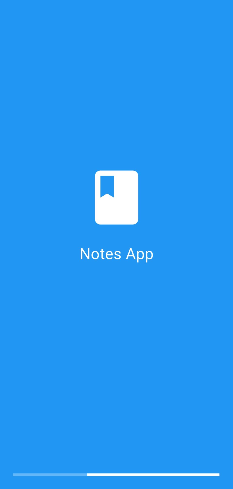
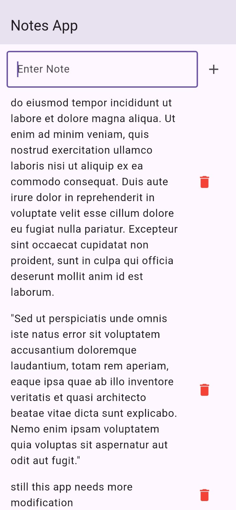

# 📝 Notes App

A simple Flutter Notes App with offline storage using **Hive** database. Notes persist even after closing the app!

---

## 📸 Screenshots

<table>
  <tr>
    <td align="center"><b>Splash Screen</b></td>
    <td align="center"><b>Home Screen</b></td>
  </tr>
  <tr>
    <td></td>
    <td></td>
  </tr>
</table>

---

## 🚀 Features

- Splash screen with custom app icon and loading bar
- Add notes with a text field
- Delete notes with red trash icon
- Notes saved locally — data stays even after app restart
- Clean and minimal UI

---

## 🛠️ Tech Stack

- **Flutter** (Dart)
- **Hive** — lightweight local NoSQL database
- **hive_flutter** — Flutter integration for Hive

---

## ⚙️ Setup

### 1. Clone the repo
```bash
git clone https://github.com/Ramzankhan-dev/Flutter-Fellowship.git
cd Flutter-Fellowship/notesapp
```

### 2. Install dependencies
```bash
flutter pub get
```

### 3. Run the app
```bash
flutter run
```

---

## 📁 Project Structure

```
lib/
├── main.dart           # Hive init, app entry point
├── splash_screen.dart  # Splash screen (3 sec) with progress bar
├── home_screen.dart    # Add, view & delete notes
└── assets/
    └── icon.png        # App icon
```

---

## 📦 Dependencies

```yaml
dependencies:
  hive: ^2.2.3
  hive_flutter: ^1.1.0
```

---

## 👨‍💻 Author

**Ramzan** — Flutter Developer

---

## 📄 License

This project is open source and available under the [MIT License](LICENSE).