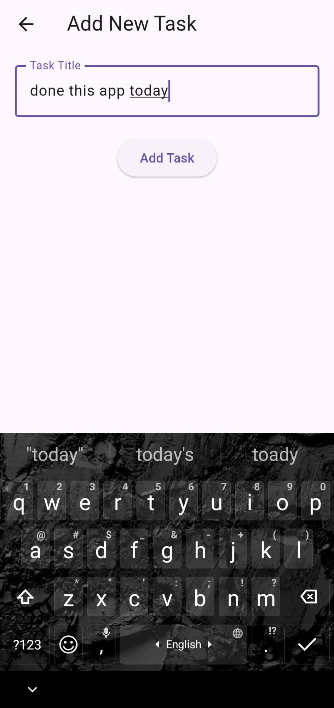
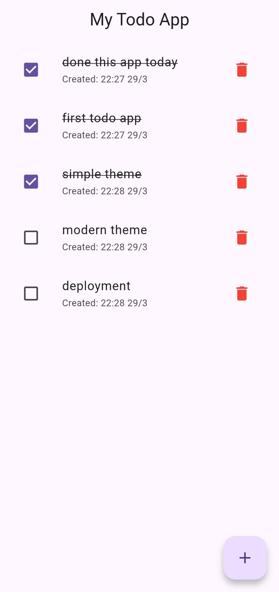

# ✅ My Todo App

A clean and simple Flutter Todo App built with **Provider** state management. Add tasks, mark them complete, and delete them with ease.

---

## 📸 Screenshots

<table>
  <tr>
    <td align="center"><b>Home Screen</b></td>
    <td align="center"><b>Add New Task</b></td>
    <td align="center"><b>Task List</b></td>
  </tr>
  <tr>
    <td></td>
    <td></td>
    <td></td>
  </tr>
</table>

---

## 🚀 Features

- Add new tasks with a title
- Mark tasks as complete (strikethrough effect)
- Delete tasks
- Shows creation date & time
- Empty state message when no tasks exist
- Clean purple-themed UI

---

## 🛠️ Tech Stack

- **Flutter** (Dart)
- **Provider** — state management
- **MVVM** architecture (Model, ViewModel, View)

---

## ⚙️ Setup

### 1. Clone the repo
```bash
git clone https://github.com/Ramzankhan-dev/Flutter-Fellowship.git
cd Flutter-Fellowship/todoapp
```

### 2. Install dependencies
```bash
flutter pub get
```

### 3. Run the app
```bash
flutter run
```

---

## 📁 Project Structure

```
lib/
├── main.dart
├── modals/
│   └── task_modal.dart        # Task data model
├── viewmodals/
│   └── task_provider.dart     # Provider - state management
└── views/
    ├── home/
    │   ├── home_screen.dart    # Main task list screen
    │   └── add_task_screen.dart # Add new task screen
    └── widgets/
        └── task_tile.dart      # Individual task widget
```

---

## 📦 Dependencies

```yaml
dependencies:
  provider: ^6.0.0
```

---

## 👨‍💻 Author

**Ramzan** — Flutter Developer

---

## 📄 License

This project is open source and available under the [MIT License](LICENSE).